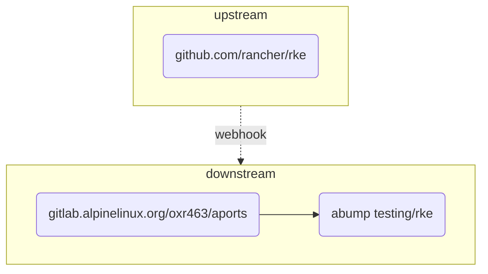

# Automated Package Bumps

Let's use `testing/rke` as an example.

```mermaid
flowchart TD
  upstream -. webhook .-> downstream

  subgraph upstream
    github-releases(github.com/rancher/rke)
  end

  subgraph downstream
    gitlab-repository(gitlab.alpinelinux.org/oxr463/aports) --> gitlab-pipeline(abump testing/rke)
  end
```

